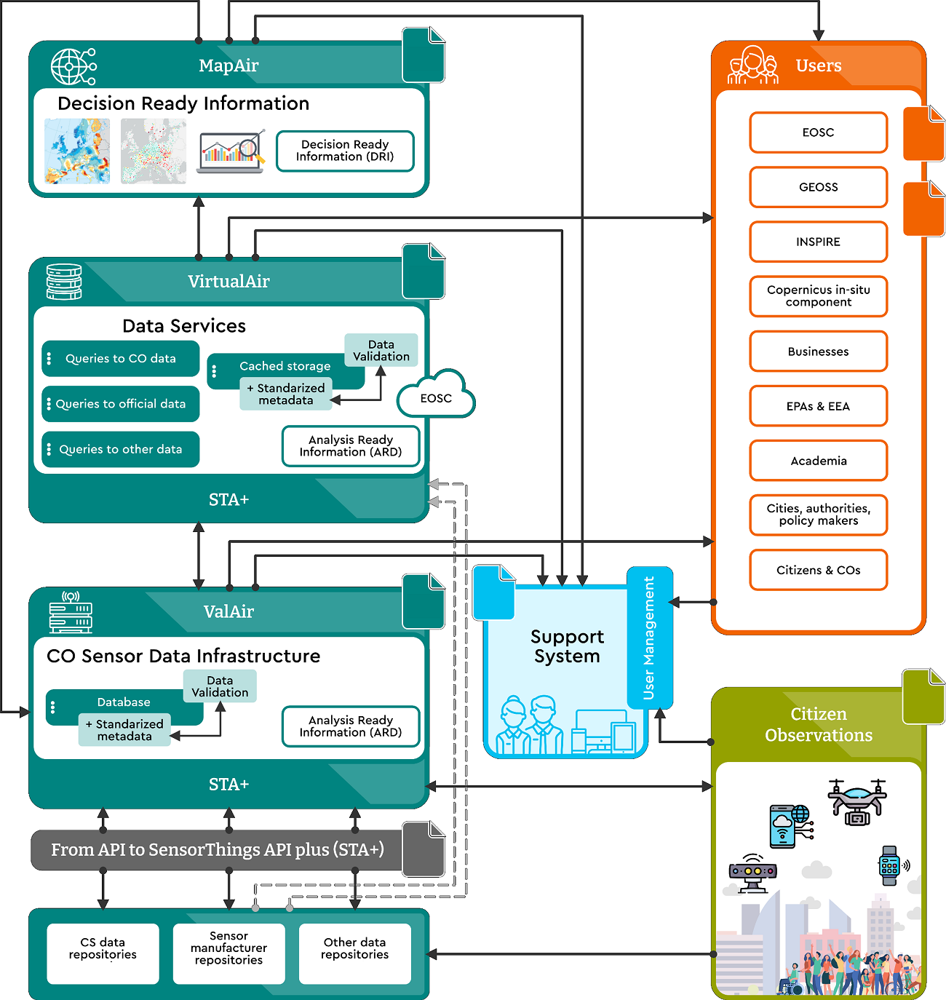

# How to deploy an architectural stack that transforms raw data to Decision Ready Information?

### Description

CitiObs develops a robust technical architecture to support citizen observatories in collecting, processing, and sharing environmental data in a transparent and interoperable way. The architecture integrates sensor technologies, open data platforms, and standardised protocols to ensure reliable data flows from collection to visualization, empowering communities and decision-makers alike.

### Why is this relevant?

There are several projects and initiatives providing Low-Cost Sensors for Environmental Monitoring such as sensor.community or smart.citizen, monitoring e.g. particulate matter, noise or temperature. Generally, This initiatives use data platform where all the data from individual sensors is collected, stored and made available. While this data platforms have some similarities they are not interoperable and data from two of those platforms cannot be easily aggregated.

In contrast, we use an interoperable architecture based on a set of standards and tools conforming to them for increasing data interoperability, so a dataset can be merged with other datasets coming with other platforms, but first we need to be sure that each dataset is quality controlled and filtered to ensure that the data is ready for analysis. This step is called ValAir and it is described in [How to validate raw data to create Analysis Ready Data?](how-validate-raw-data.md). 

Once the data has a similar level of quality and it is ready for analysis, data can be aggregated if it is provided into an standards API. The selected API is called SensorThings API and its extension STAplus. It is described in [How to offer observations with a neutral data model and in an interoperable API?](data-platforms/how-to-offer-obs-data-model-API.md). The aggregation can be done by harvesting the original sources or by creating an federated service also responding to SensorThings API request that collect the necessary information on the fly from the initiatives APIs. By opting for the second approach, we demonstrate interoperability and we can provide a more up-to-date data. This way for example, initiatives from several regions or countries can be federated in a near real time air quality map showing air quality status of all Europe. The tool to federate ARD APIs into a single API is called VirtualAir and it si described in [How to centralize access to Analysis Ready Data?](how-centralize-access-ARD.md). 

STAplus service can be regularly queried to know the status and evolution of a particular sensor but they can also accept subscriptions if they enable the WebSub extension standard. This way, you can subscribe to receive notifications for example, only when pollution reaches some threshold. You can read more about this characteristic in [How to add a real-time alerting system on the web?](how-to-add-a-real-time-alerting-system-on-the-web.md).

However, VirtualAir responses still provides only observations where the sensors are actually deployed and nothing in between. That is why a final step was added to the general architecture that converts individual observations into a continuous map describing the whole situation in a particular time instant. The series of this maps forms a sequences ot scenes in a time series (like a film) that exposes the status and evolution of the pollution in Europe. This maps are ready for interpretation and to take decisions targeting pollution hot spots. We call this maps Decision Ready Information, and you can read more about them in [How to generate Decision Ready Information for Analysis Ready Data?](how-generate-DRI-from-ARD.md). 

In other to facilitate the decision making process, data needs an easy way to be visualized and presented to the final user. This is the mission of the Decision Support System that presents the observations (Virtual Air) and the maps (MapAir) in a context (a.k.a. with other information) and allow extraction of insights for communities, researchers, and local authorities. Built with a user-centered approach, it’s designed to be intuitive, accessible, and practical. Through maps and charts, users can explore air quality and other environmental data down to individual sensor readings. The tool benefits for the flexibility of SensorThings API standard to request the exact amount of data necessary for the user. You can read more about it in [How 
to add a data visualization to support decision?](how-to-add-visual-support-system.md).

Figure: Architecture diagram to transform raw data that into Decision Ready Information

### You might also be interested in…
  * [How to validate raw data to create Analysis Ready Data?](how-validate-raw-data.md)
  * [How to centralize access to Analysis Ready Data?](how-centralize-access-ARD.md)
  * [How to generate Decision Ready Information for Analysis Ready Data?](how-generate-DRI-from-ARD.md)
  * [How to add a real-time alerting system on the web?](how-to-add-a-real-time-alerting-system-on-the-web.md)
  * [How to add a data visualization to support decision?](how-to-add-visual-support-system.md)