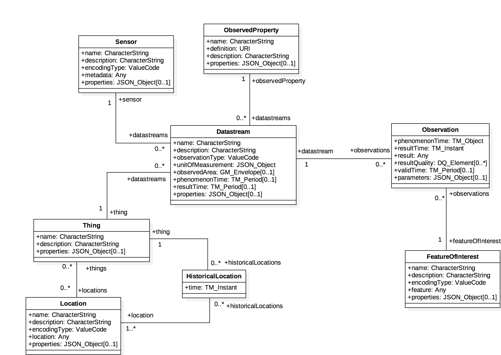

# How to offer observations with a neutral data model and in an interoperable API?

### Description

To offer observations using a neutral data model and in interoperable API, CitiObs proposes to use the SensorThings API and STAPlus as the foundation for a vendor-neutral, 
data-neutral system. 

SensorThings API (STA) is an open standard developed by the Open Geospatial Consortium (OGC) for connecting IoT devices, data, and applications using a geospatial-enabled, unified data model and RESTful web interface. It provides a standardized data structure for observation, linking data to sensors and things, without bias toward vendor or data type.

Figure: OGC STA Sensing Entities Diagram

STAPlus is an extension to the OGC SensorThings API (STA) designed to improve the handling of sensor data, especially for multi-user environments and citizen science applications. It adds features for expressing ownership, licensing, and grouping of observations, addressing requirements such as user association, licensing for data re-use, and relating observations with other resources and supporting interoperability and compliance with FAIR principles. STAPlus prevents personal data storage in the API itself, keeping the model unbiased and privacy-compliant.

### Why is this relevant?

STA is already adopted in many smart cities, with the addition of the extension STAPlus to include the human dimension of data collection and the concept of ownership by
licencing. These standards ensure interoperability, rapid deployment, and the adoption of existing and future
sensors, devices, and data, which therefore permit easy integration of the data generated by the COs in an
interoperable architecture of services compatible with the European Open Science Cloud (EOSC) and other
infrastructures.

### Useful resources

* [OGC SensorThings API](https://www.ogc.org/standards/sensorthings/). OGC SensorThings API and STAPlus.
...