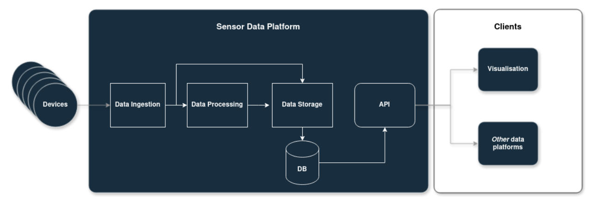

# What are the main components of a sensor data platform?

## Description

A sensor data platform is a comprehensive framework designed to collect, process, store, manage, and utilize data generated by sensing devices deployed in various environments. These platforms are well suited for Citizen Observatories in the field of air quality, and they have been broadly used for this purpose with minor adaptations. Key components include the ingestion of data coming from distributed networks of devices capturing physical parameters, mechanisms for data processing, storage solutions for organizing and archiving data, visualization tools for data representation, security measures to protect data integrity and privacy. Additional features may include the integration with other sources for contextual enrichment and scalability to accommodate growing data volumes.

## Why is this relevant?

Sensor data platforms allow collecting, processing and sharing data from distributed networks of sensing devices. However, there are many choices we need to take when designing and implementing such platforms, both on the technical and non-technical side. In this section, we will mostly discuss conceptual choices, such as the ability for the platform to communicate with other platforms (interoperability), or for users to be able to access data in a free and easy way (findable and accessible). These are relevant aspects as the proliferation of platforms in recent years shows both the diversity in approaches, but also the great potential the data on these platforms has when these aspects are well thought through. Other very relevant aspects to consider fall on the technical side, such as transmissions protocols to use, type of databases, API choices, all of which will significantly impact the technical development efforts and the maintainability of the platform in the future.

## How can this be done?

The following main components are generic to a typical sensor data platform:

Figure 4. Main components of a sensor data platform

1. **Data ingestion:** the data ingestion component oversees the interaction with the devices and _ingest_ the data coming from them. The complexity of this block will depend on the transmission protocol and format that the devices send the data in. This block needs to be always running, especially if the sensing devices do not have ways to store data locally.
2. **Data processing**: data processing pipelines take care of any transformation (typically mathematical) that the sensor data requires before making it to the database (DB). This involves pre-processing data to handle noise and outliers, applying calculations to raw data, or applying algorithms for feature extraction and pattern recognition, as well as more advanced analytics tools (e.g., machine learning models) for predictive analysis and anomaly detection.
3. **Data storage**: this component will store the data (processed or not) in the database. The database is generally not accessible externally, and its access is managed by the API. This is the core component, as it will store all data coming from the sensing devices, as well as other data (like location, users, or contextual information. The database allows various CRUD operations (Create, Read, Update, Delete).
4. **API:** The API is the interface that computers will use to interact with the data platform (and ultimately with the database). This interface will typically have various endpoints, where data from different data tables in your database can be presented. The API needs to be able to present data efficiently, interacting with your data storage correctly and in an understandable way for other people to be able to use it.

**On the client side,** typically, we will find users interacting with the data platform, normally via the API by using web applications or scripts or other platforms (such as data aggregators) that request data from the sensor data platform and potentially perform other operations on it. Sensor data platforms will generally have a data visualisation method, such as dashboards enable users to explore and interact with sensor data through charts, graphs, maps, and other visualizations, allowing them to gain insights and derive meaning from the data, but it’s not mandatory for the platform to be consider as such.

## Useful resources

* What is a REST API? Postman blog: [https://blog.postman.com/rest-api-examples/](https://blog.postman.com/rest-api-examples/)

## You might also be interested in….

* [What should be considered when building a sensor data platform for COs?](what-should-be-considered-when-building-a-sensor-data-platform-for-cos.md)
* [What aspects to consider when choosing an infrastructure/platform?](../sensing-devices/what-aspects-to-consider-when-doing-mobile-monitoring.md)
* [What to consider for increasing interoperability among sensor data infrastructures?](what-to-consider-for-increasing-interoperability-among-sensor-data-infrastructures.md)
