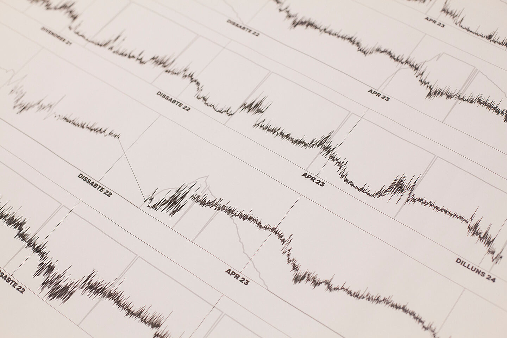
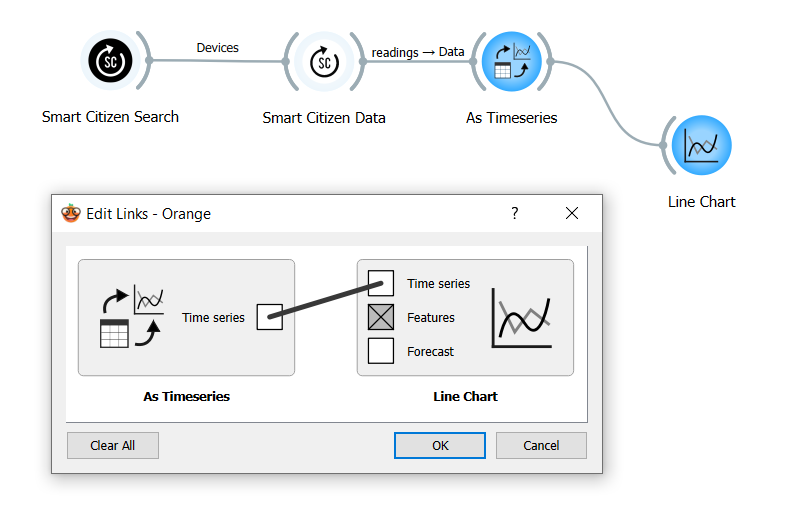
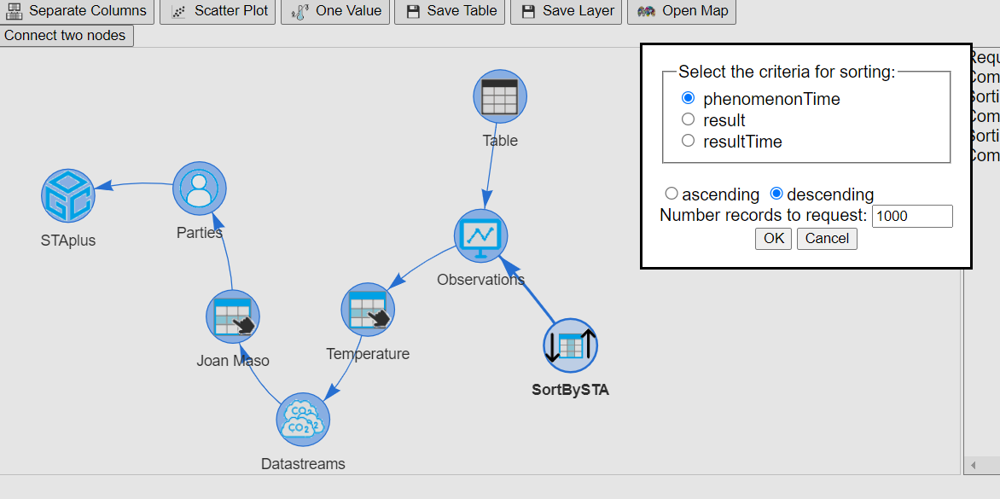

# How can I analyse and visualize my data?

<figure><figcaption>
Data tools
</figcaption></figure>

## Description

Visualization of air pollution data is crucial for understanding complex information and communicating findings effectively. By presenting air quality data in visually intuitive formats such as graphs, maps, and charts, stakeholders can quickly grasp patterns, trends, and relationships within the data. Visualization facilitates the identification of trends, anomalies, and spatial variations in pollution levels, enabling decision-makers to target interventions, allocate resources, and prioritize mitigation strategies accordingly. Moreover, clear and compelling visualizations raise public awareness about air pollution issues, educate communities about the sources and health impacts of pollution, and motivate individuals to take action to protect their health and the environment. Overall, visualizing air pollution data enhances understanding, promotes collaboration, and empowers stakeholders to address air quality challenges more effectively.

This section will compile a list of tools that will help us navigating the complexities of data analysis and visualization, going from simple to use ones, to more advanced data frameworks.

## Why is this relevant?

Technical tools should be tailored to their specific purpose and should avoid unnecessary complexities. In the realm of data analysis and visualization, where tasks can often be intricated, selecting the appropriate tool is paramount to staying focused on the primary objective: extracting insights and addressing questions. Typically, due to the substantial volume of data collected or the characteristics of sensing devices, software becomes a necessity at various stages of the process. However, as we'll explore further, not all phases of the process require the same types of tools, and there are instances where software tools may be entirely unnecessary, especially when engaging with non-technical audiences. Additionally, many of these tools are readily available as open-source solutions, minimizing the reliance on complex proprietary software.

## How can this be done?

1. **Data preparation:** in this step, we take the data from its source (i.e. an API, a CSV file, a data stream, etc.) and we convert it, generally, into a format that can be understandable by a machine in an general ways (a spreadsheet, a data table or else). This process generally involves some sort of software, either generic tools such as spreadsheets as MS-Excel and Libre Office, web tools, or more advanced ones such as programming frameworks or scripts. It is generally recommended to perform this task prior to the data analysis itself, generating what we like to call Analysis Ready Data (ARD). ARD can then be used with confidence by both technical and non-technical users, and the tools to be used will greatly depend on the final audience for that data.
   1. Data collection: gather data from various sources, such as databases, spreadsheets, APIs, or sensing devices. Ensure that the data collected is relevant to the analysis objectives and represents the population or phenomena of interest.
   2. Data cleaning: clean the data to remove errors, inconsistencies, and missing or erroneous values that could affect the analysis, leading us to erroneous conclusions. This process is generally complex, and expert knowledge is recommended as there is no standard tool for it. Some recommended tools are listed in the useful resources below.
   3. Data correction: this step involves correcting our data in case there are any known factors that may affect it. For instance, many environmental sensing devices, specially low-cost ones, may suffer from temporal drift and decay (i.e. over time, they don’t measure as well as at the beginning). These effects, if characterized and known, can be corrected, but generally, this process needs to be done by expert hands, or well-crafted automated processes. Some tools are listed in the useful resources section below.
   4. Data Validation: validate the prepared data to ensure that it meets the requirements of the analysis objectives and is free from errors or biases. This may involve conducting Exploratory Data Analysis (EDA) to examine the distributions, correlations, and patterns in the data.
2. **Data analysis:** the core task of this section. Once we have data in an analysis ready state, we can move onto extracting insights from it. Some common methods are:
   1. Data fusion, data assimilation: integrate data from multiple sources.
   2. Data aggregation: aggregate data spatially or temporally. Select appropriate aggregation functions to calculate summary statistics. Common aggregation functions include sum, count, average, minimum, maximum, median, standard deviation, and percentiles.
   3. Metrics extraction: this process involves using statistical or calculus methods to extract characteristics from the data. In other words, we can represent certain features of our data by using simple and comparable indexes. For instance, these represent what are the minima, maxima or average of our data, or how well sensor data represents our truth values.
3. **Data visualization:** this involves converting data tables and pure numbers into visual representations of the data. Simple tools such as spreadsheets, can be useful for small amounts of data, but to handle bigger datasets, more capable frameworks may be needed. There is a wide variety of open source and free tools available for this purpose, and we have listed some popular tools in the table below, and there is a tool adapted for each level of expertise and data needs. It is generally coupled with the metrics extraction step below.

### CitiObs Tools

* [Orange data tools](https://github.com/CitiObs/orange-sensors): data analysis tools with visual programming as add-ons for [Orange Data Mining software](https://orangedatamining.com/). Widgets have been developed to access data from [Smart Citizen](https://smartcitizen.me) and [STAplus](https://docs.ogc.org/is/22-022r1/22-022r1.html).

<figure><figcaption>
Orange data tools
</figcaption></figure>

* [Python](https://www.python.org/) and [R](https://www.r-project.org/) libraries: there are several libraries for analysing data in python. In CitiObs we have done some libraries for accessing data and provided examples for analysing data in python/R.&#x20;
  * STAplus-Python-Client: [https://github.com/securedimensions/STAplus-Python-Client](https://github.com/securedimensions/STAplus-Python-Client)
  * Smart Citizen Connector [https://github.com/fablabbcn/smartcitizen-connector/](https://github.com/fablabbcn/smartcitizen-connector/)
  * Jupyter Notebooks examples using these libraries: [https://github.com/CitiObs/data-recipes](https://github.com/CitiObs/data-recipes)
* [TAPIS](https://tapis.grumets.cat/): TAPIS is a API explorer and a table manager. TAPIS reads data and metadata from some supported APIs and some data file formats and structures the data as tables that can be managed and transformed. Internally, everything is a table that has columns that represents fields and rows that represent records. The supported data sources are: Sensor Things API, STAplus, OGC API Features/Records, OGC Catalogue Service for the Web, S3 Services, Eclipse Data Connectors, CSV, DBF, JSON-LD, JSON and GeoJSON files. Once the data is represented as a table, it can be directly viewed, edited, semantically enriched, filtered, joint, grouped by, aggregated, etc. A part of a classical rows and columns tabular representation, data can be presented as bar charts, pie charts, scatter plots, and maps. TAPIS is integrated with [NiMMbus](https://github.com/grumets/nimmbus) (MiraMon implementation of the Geospatial User Feedback) and with the [MiraMon Map Browser](https://github.com/grumets/MiraMonMapBrowser).

<figure><figcaption>
Example of TAPIS tools
</figcaption></figure>


Examples for TAPIS can be found in the [recipes section of the help](https://tapis.grumets.cat/help/#recipes).


## Additional resources

* [R Shiny](https://shiny.posit.co/): R Shiny is a web application framework for R, a popular programming language for data analysis and visualization. Citizen scientists can use R Shiny to develop interactive web-based dashboards and applications for analyzing and visualizing air quality data. R Shiny offers flexibility and customization options, allowing users to create tailored visualizations and share their findings with others.
* [ECSA WG Learning and education in Citizen Science](https://sites.google.com/view/citizen-science-education/home)**:** gathers school and higher education teachers; educators from museums, community spaces and after-school activities; educational researchers; scientists; and other communities interested in developing the informal learning and educational aspects of their Citizen Science projects.

## You might also be interested in….

* [What are the main aspects you need to consider when managing citizen collected data?](what-are-the-main-aspects-you-need-to-consider-when-managing-citizen-collected-data.md)
* [What is data quality? How can we increase data quality in citizen gathered data?](what-is-data-quality-how-can-we-increase-data-quality-in-citizen-gathered-data.md)
* [How to make data accessible to non-experts in a clear and understandable format?](how-to-make-data-accessible-to-non-experts-in-a-clear-and-understandable-format.md)
