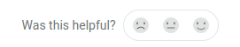

# Contributions & Feedback

We welcome your feedback to this toolkit via email or on [Github](https://github.com/CitiObs/environmental-monitoring-toolkit). You can also use the feedback buttons on the Gitbook interface.

### Feedback via Gitbook

You will find the following feedback icons on the page.

<figure><figcaption>
Feedback interface
</figcaption></figure>

We really appreciate the feedback, specially if you can add some additional context for us to improve:

<figure><figcaption>
Add some additional context!
</figcaption></figure>

### Submitting via GitHub / email

So that the feedback is clear, we would like to ask to follow the following guidelines (contributing guidelines):

* I'm submitting a...​
  * problem report​
  * new content request​
* What is the current behavior?​
* If the current behavior is a problem, please provide the details of where you found it (which page and section).​
* What would you improve?​
* What is the motivation / use case for changing the behavior?​
* Other information

### Contributions

The easiest way to contribute is via a GitHub issue and, if you can, a Pull request. This process can be scary at first, but it's the way it's done in the _open source_ community.


Check the following \[documentation on pull requests]\([https://docs.github.com/en/pull-requests](https://docs.github.com/en/pull-requests)) and learn more about \[issues]\([https://docs.github.com/en/issues/tracking-your-work-with-issues/using-issues/creating-an-issue](https://docs.github.com/en/issues/tracking-your-work-with-issues/using-issues/creating-an-issue))

