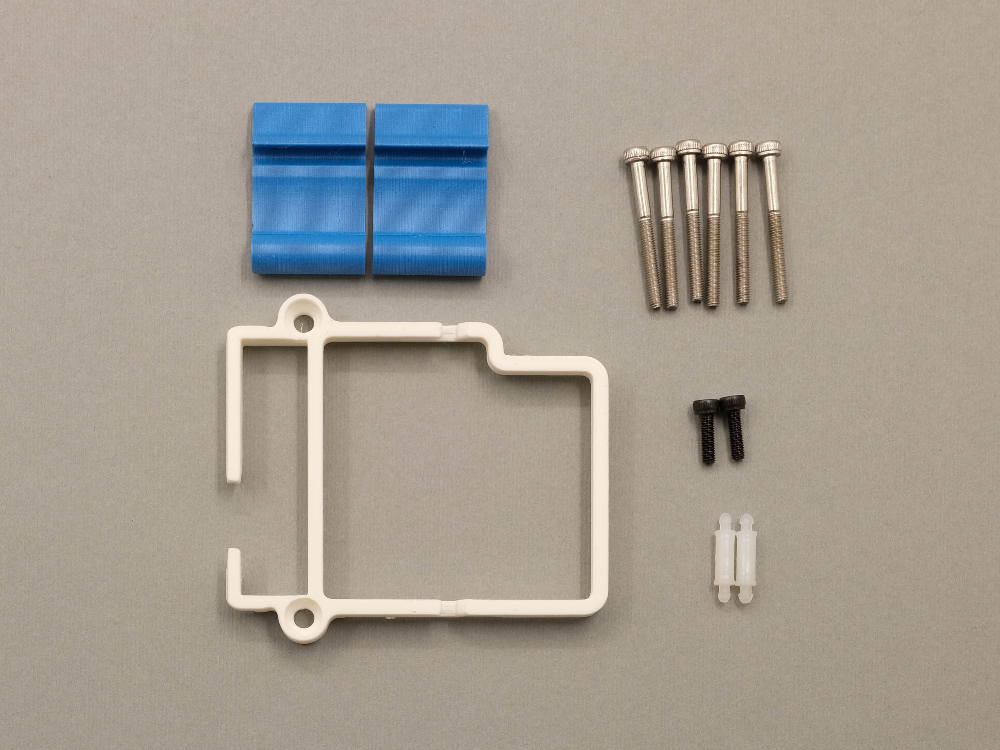
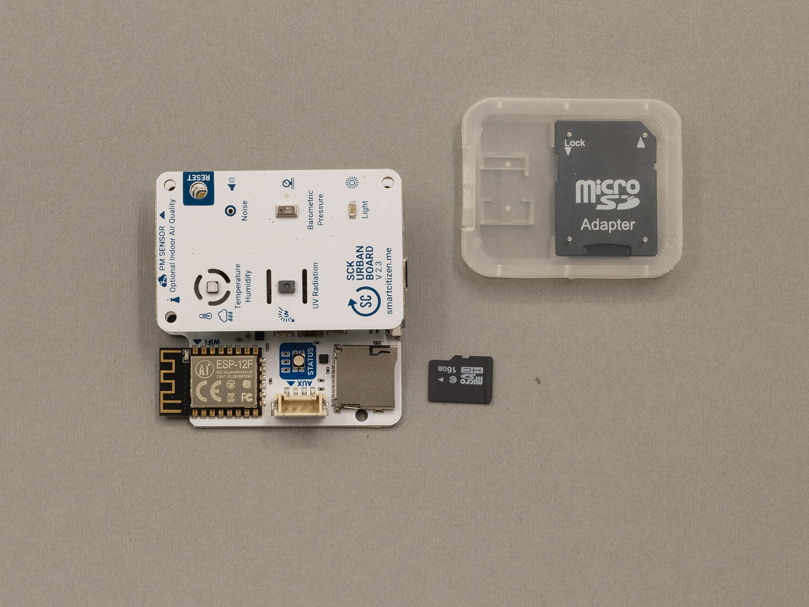
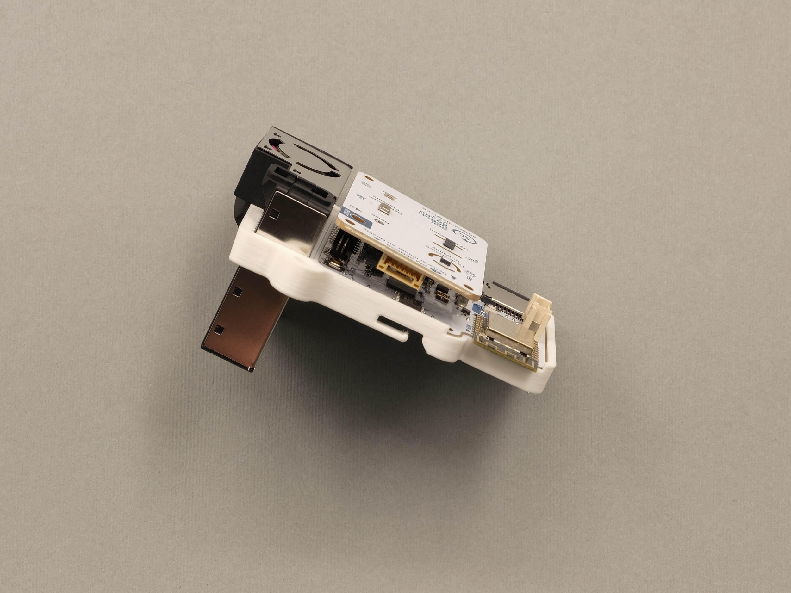
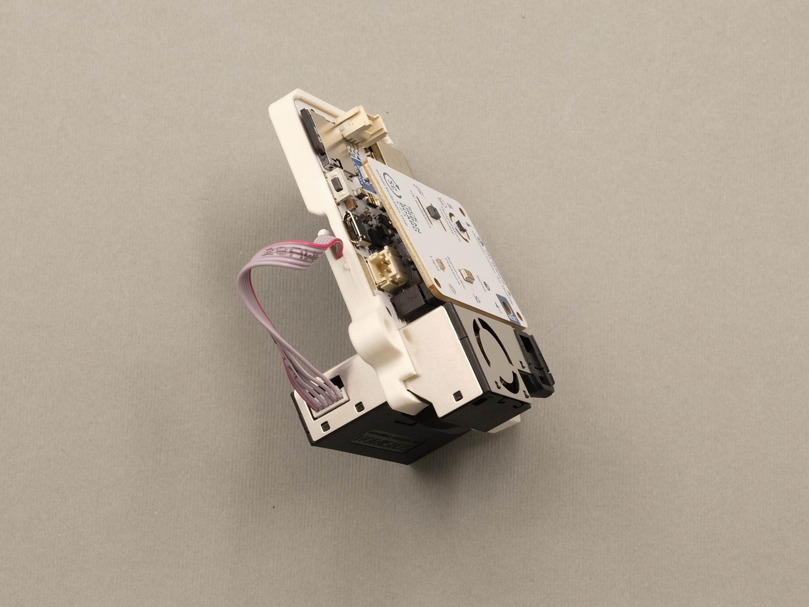
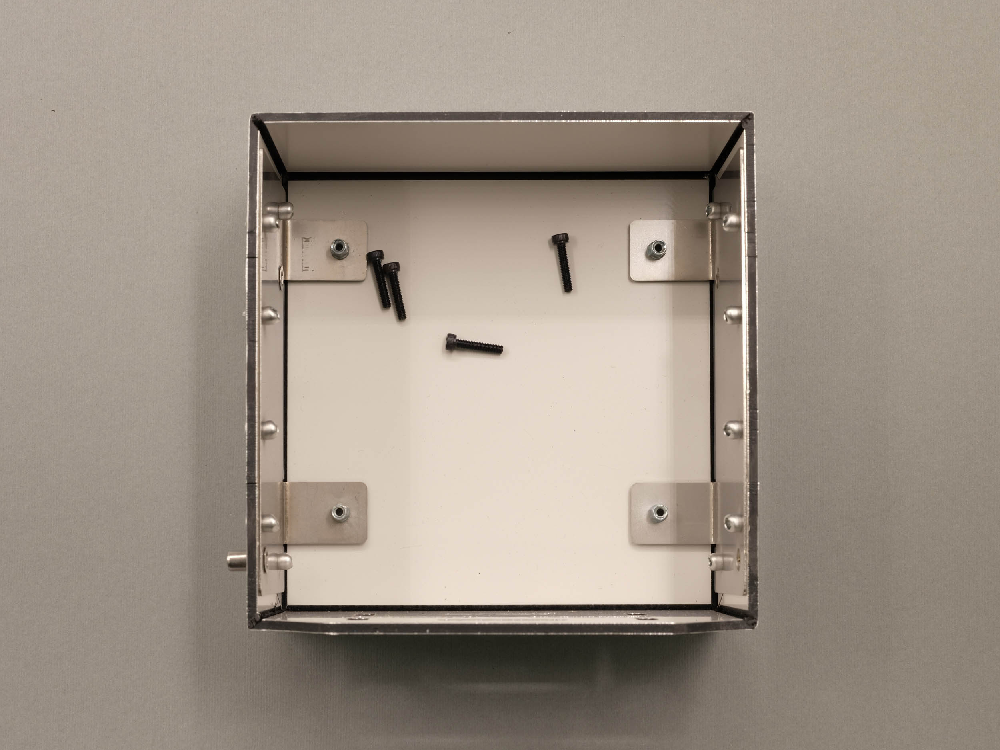
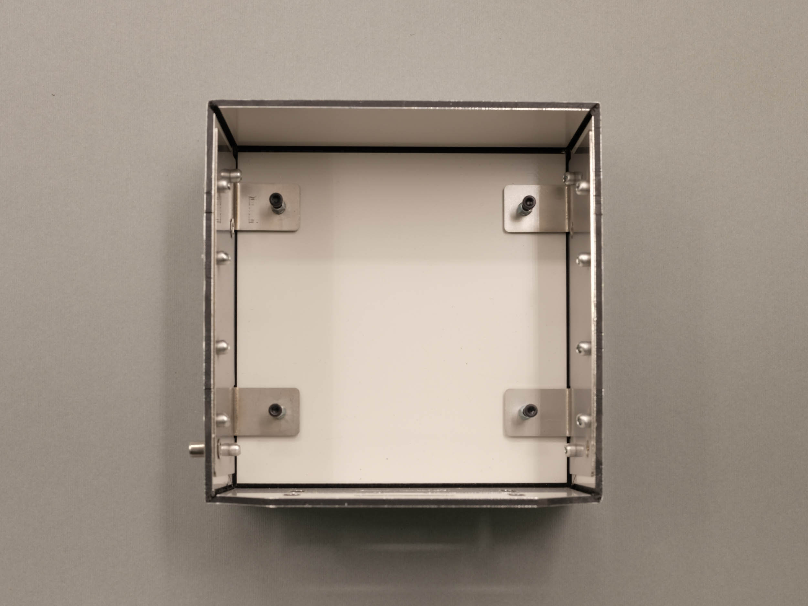

# How to setup a Smart Citizen Kit for air quality monitoring?

This guide will help COs assemble Smart Citizen Kits, register them, and deploy them to start collecting data. The Smart Citizen Kit (SCK) is an open source environmental monitoring device, customizable and modular for multiple use cases.


The devices provided as part of CitiObs are Smart Citizen Kits (or SCK). These devices are _open source, customizable_ environmental monitoring devices, and they are developed from Barcelona.

If you are interested, you can order them from [LabMaker](https://www.labmaker.org/products/smart-citizen-kit) or [SeeedStudio](https://www.seeedstudio.com/Smart-Citizen2-3-p-6327.html). Contact us at [info@smartcitizen.me](mailto:info@smartcitizen.me) for more information on custom developments.


Depending on what type of device you have (we also call them _kits)_, you will need to start at a different step:

* If you have a DIY[^1] kit, you will need to follow the [device assembly section](how-to-setup-the-smart-citizen-kit-for-air-quality-monitoring.md#device-assembly) and then move on to the [device registration section](how-to-setup-the-smart-citizen-kit-for-air-quality-monitoring.md#device-registration).
* For cases that requested pre-assembled kits, you can skip ahead to the [device registration section](how-to-setup-the-smart-citizen-kit-for-air-quality-monitoring.md#device-registration).


**Important note!**

**Mobile kits and kits with more complex metrics (CO2 or NO2) are not available as DIY due to their complexity** and the need for more elaborate testing before shipment.

These devices will been shipped pre-assembled regardless of the overall requested preference for the Alliance Case.


## Device assembly

DIY kits will need to be assembled before deployment. All the components needed are shipped along with the sensors, including 3D printed enclosure components, screws, etc.


However, simple tools like screw drivers **are not included** and will need to be acquired separately to complete the building process. The exception to this are the HEX keys which are less common. 1-2 of each is provided per DIY Alliance Case.


### Components


For DIY kits, there is a small code printed on the box (a four-digit code with a mix of letters and numbers - see component photos below). You will need this code to identify your device while registering it. **It is important not to mix up the numbers,** so keep all the components from one box together and keep track of which device corresponds to which device number.\
\
We suggest you transfer the sticker from the box to the bottom of the PM sensor (see picture below) if there is not already a sticker with the same number. This way, you always have clear which device is which, and this placement gives easy access to check the code when the sensors are deployed.

\



#### Indoor Devices

For **indoor DIY kits**, you will need the following components:

* 1 x ["multipurpose" cover](#user-content-fn-2)[^2] (3D printed)
* 1 x base (3D printed)
* 1 x Smart Citizen Starter Pack box:
  * Smart Citizen Kit 2.3 with PM sensor
  * SD card and reader
  * 2Ah Battery
  * USB charger and cable
* 1 x plastic bag with the following components:
  * 2 x latches
  * 1 x clip for PM and electronics board
  * 6 x M3x30mm INOX screws
  * 2x M3x10mm screws

<figure><figcaption>
Indoor DIY components (front)
</figcaption></figure> <figure><figcaption>
Indoor DIY components (back)
</figcaption></figure>

<figure><figcaption>
Contents inside of Smart Citizen Kit Starter Pack
</figcaption></figure>

<figure><figcaption>
Contents inside of components bag
</figcaption></figure>

**Outdoor Devices**

For **outdoor DIY kits**, you will need the following components:

* 1 x [outdoor cover](#user-content-fn-3)[^3] (3D printed) :warning:
* 1 x base (3D printed)
* 1 x Smart Citizen Starter Pack box:
  * Smart Citizen Kit 2.3 with PM sensor
  * SD card and reader
  * 2Ah Battery
  * USB charger and cable
* 1 x plastic bag with the following components:
  * 2 x latches
  * 1 x clip for PM and electronics board
  * 6 x M3x30mm INOX screws
  * 2 x M3x10mm screws
  * 2 x nylon spacers
* 1 x aluminum umbrella
* 1 x power supply with cables with cover
* 1 x plastic bag with the following components:
  * 4 x M3x15mm screws
  * 1 x M4x10mm screw
  * 1 x M4x25mm screw
  * 4 x M3x15mm screws
* [Filtering foam](#user-content-fn-4)[^4] (large sheet of thin black foam, roughly A4 size)

<figure><figcaption>
Outdoor DIY components (front)
</figcaption></figure> <figure><figcaption>
Outdoor DIY components (back)
</figcaption></figure>

<figure><figcaption>
Outdoor DIY components (umbrella)
</figcaption></figure> <figure><figcaption>
Outdoor DIY components (umbrella screws)
</figcaption></figure>

<figure><figcaption>
Contents inside of Smart Citizen Kit Starter Pack
</figcaption></figure>

<figure><figcaption>
Contents inside of components bag
</figcaption></figure>

**Tools (included)**

* 1 x 2.5 HEX key
* 1 x 3 HEX key (for outdoor umbrella only)

**Tools (not included, but needed)**

* 1 x Phillips screw driver

### Assembly Steps

#### 1. Assemble the enclosure

Insert the 6 x M3x30mm INOX screws as indicated in the photographs below.


It is easiest to start with the screws on the individual sides of the enclosure, and then to close the box with the hinges in order to align more precisely the two sides.



Do not screw the components too tightly, they just need to be screwed into place so that the head of the screw is touching the 3D printed component.


<figure><figcaption>
Pre-assembly enclosure
</figcaption></figure> <figure><figcaption>
Post-assembly enclosure
</figcaption></figure>

#### 2. Assemble the device

* Insert the micro SD card into the slot

<figure><figcaption></figcaption></figure>

* Separate the two boards, insert the nylon spacers, then reconnect the boards assuring that the pins are correctly aligned. (_**See video below.**_)
* Insert the PCB boards into the 3D printed clip. There is a small groove where the board sits, slide the board all the way in and then snap the two other corners into place. (_**See video below.**_)

<figure><figcaption></figcaption></figure> <figure><figcaption></figcaption></figure>

{% embed url="https://files.gitbook.com/v0/b/gitbook-x-prod.appspot.com/o/spaces%2FNrbUZZnCHL4XtHojsGrx%2Fuploads%2FNybd4vrmSJ1QUMK3I4kH%2FCitiObs-Clip-Guide.mp4?alt=media&token=902bcc6c-6304-4834-9b7b-41ae4e4b5ba3" fullWidth="false" %}

* Insert the PM sensor into it's slot in the clip, and push it snugly into place

<figure><figcaption></figcaption></figure> <figure><figcaption></figcaption></figure>

* Connect the PM cable from the PCB board to the PM sensor feeding it through the holders on the back of the clip to keep it flat.
  * The cable orientation does not matter, both ends are the same.

<figure><figcaption></figcaption></figure> <figure><figcaption></figcaption></figure>

* Insert the components into the base of the enclosure, ensuring that it is fully pushed into the enclosure.

<figure><figcaption></figcaption></figure>

* Tuck the battery into place behind the PCB board, using the PM cable to keep it in place.

<figure><figcaption></figcaption></figure>

* Use the 2x M3x10mm and the 2.5 HEX key to screws to screw the clip and components into place

<figure><figcaption></figcaption></figure>

#### 3. Assemble the umbrella (for outdoor devices only)

* Using the 2.5 HEX key, install the 4 x M3x15mm screws into the four holes on the underside of the umbrella.

<figure><figcaption></figcaption></figure> <figure><figcaption></figcaption></figure>


These screws should only be screwed in far enough that the screws touch the material below, they do not need to be tightened further, doing so can damage the umbrella.


* Align the enclosure as indicated in the left image below. Using the M4x10mm screw and the 3 HEX key connect the power supply box to the umbrella (bottom left hole, as indicated in the right image), then secure the enclosure using the M4x25mm screw (top left hole) with the 3 HEX key. This should lock the device in place. Check that the device does not move and that you can see the screw pushing the top of the device down securely.

<figure><figcaption></figcaption></figure> <figure><figcaption></figcaption></figure>

* Using the 4 x M3x15mm screws and a Phillips screw driver, attach the power supply cover.

<figure><figcaption></figcaption></figure>

* Feed the USB cable through the enclosure box and plug it into the device.

<figure><figcaption></figcaption></figure> <figure><figcaption></figcaption></figure>

* Connect the battery and plug in the device into a wall outlet.

<figure><figcaption></figcaption></figure>


Due to the power needs of the SCK2.3 (and SCK2.2), the SCK always needs a battery connected.


* Cut and insert filtering foam to protect the sensors from water and dust buildup (this foam was included with other materials as a large sheet, roughly A4).


Note, this is the foam we are talking about...



<figure><figcaption></figcaption></figure>

## Device registration

Once the device is assembled, you can proceed to register your device in the online platform. CitiObs devices are registered through the [Smart Citizen Platform](https://smartcitizen.me/kits). There are two steps to this:

1. [Create an account in the platform, and register all your devices on it](how-to-setup-the-smart-citizen-kit-for-air-quality-monitoring.md#onboarding-your-device)
2. Share the account name with Smart Citizen Team ([info@smartcitizen.me](mailto:info@smartcitizen.me)) to enable _research_ options
3. [Enable data forwarding to CitiObs tools](how-to-setup-the-smart-citizen-kit-for-air-quality-monitoring.md#enable-data-forwarding-to-citiobs-tools)

### Onboarding your device

The _onboarding_ app will guide you through the process of the setup using simple language and a friendly graphic language.


**To read before you proceed**

The Smart Citizen platform requires a free account to register a device or, in other words, each device requires an owner.

We recommend using **one account per case in CitiObs**, and to register all the devices in a certain case on the same account.


Visit the _onboarding_ app at [start.smartcitizen.me](https://start.smartcitizen.me/). Before you start make sure you have:

* A computer to visit the onboarding app
* A smartphone (or tablet, or another computer) to connect to the kit and configure it

The app will guide you through the steps. Let us know if there is any issue.

### Enable data forwarding to CitiObs Platform

The easiest way to enable forwarding is to visit your device on [the website](#user-content-fn-5)[^5] and click on the `EDIT button` on the bottom part of the graphs.

Then, scroll down to the forwarding section and enable the checkbox. Make sure all the other settings are shown as in the image below, and to hit **update** when you are done!

<figure><figcaption>
Enable MQTT forwarding
</figcaption></figure>

In addition, please add the `CitiObs` `tag` on your device:


If you do not see this, please contact us at [info@smartcitizen.me](mailto:info@smartcitizen.me)



Once you are done, make sure you hit **Update**!


### Enable notifications

The easiest way to enable forwarding is to visit your device on [the website](#user-content-fn-5)[^5] and click on the`EDIT button` on the bottom part of the graphs.

Then, scroll down to the notifications section and enable both. This will trigger an email in case the device stops publishing. This step is crucial to ensure that, in the event of sensor malfunction, we can avoid data loss. There are no additional notifications on that email.


Once you are done, make sure you hit **Update**!


### Create an _experiment_

_An experiment is a way to group devices and share data with others through the Smart Citizen Platform. You can create an experiment by visiting your user profile:_

<figure><figcaption></figcaption></figure>

Fill out the relevant information such as `name`, `description`, `start and end dates` and add the devices on the `KITS` section. You can search there for your COs devices and create a collection of devices which is very handy to share later on.


You can look at an example experiment at: [https://api.smartcitizen.me/ui/experiments/6](https://api.smartcitizen.me/ui/experiments/6)



### Advanced devices

Advanced devices (such as NO2 devices), requires handling of calibration data. For this reason, it's necessary to store the physical ID (`Station ID` or `Hardware ID`) of the unit alongside to the virtual device in the Smart Citizen Platform. The hardware ID should normally be in a sticker to the enclosure both inside and outside and looks like this:

**Station ID**

* This number is important to relate to the actual calibration values of the sensors, stored in the data repository. In order to postprocess the data and calculate pollutants, make sure that the `Station ID` is safely stored in the platform's device


This hardware ID is not the same as the `device ID`. The `device ID` is the number you have after the smartcitizen.me/kits/ url where you see the data of your device. The `Station ID` is the one in the sticker. The `Station ID` is not meant to change, while the `device ID` can change as you can register your kit many times!


* The easiest way to enable forwarding is to visit your device on [the website](#user-content-fn-5)[^5] and click on the`EDIT button` on the bottom part of the graphs.

* Then, in the `hardware URL` field, introduce the number in the sticker (it should be something like `SCAS2200XX`)

* Once this process is done, you should be able to check that the postprocessing is safely stored in the Platform by visiting the following link (Make sure your`<DEVICE-ID>` is correct): `https://api.smartcitizen.me/v0/devices/<DEVICE-ID>/`


After this, we will take care of processing the data in a periodic way.


## Device Deployment

### Indoor devices

There are **only** two possibilities for the device to be placed indoors: laterally or vertically.


The device **should never be placed horizontally** (wide side flat on a surface). This placement would cover completely the sensor inlets, or leave them exposed to dust accumulation. Likewise, the sensors, do not work properly on this configuration.


### Outdoor devices

The outdoor devices are deployed as below:

Some basic deployment tips:

* Try to keep the device continuously powered if it is installed in a fixed location.
* Avoid using the device in places with high humidity or large amounts of dust; otherwise, clean/check the device periodically to prevent potential issues.
* Avoid covering the sensors, especially the PM sensor.
* Deploy the device facing downwards if outdoors, so that dust doesn't accumulate on the sensors.
* Avoid direct airflow towards the sensors; if exposed under flow conditions, keep the flow parallel to the sensor surfaces.
* Avoid exhaust from air conditioning units, kitchens, etc.
* Protect the sensors from moisture using filtering foam, nail polish, or both to cover the sensor pads (see [here](https://docs.smartcitizen.me/_FAQ/#are-the-electronics-waterproof)).

## Additional information

The [Smart Citizen Documentation](https://docs.smartcitizen.me) provides all information related to the hardware, the data and what can be done with it. Some quick links:


🚀 **Installation**: [start.smartcitizen.me](https://start.smartcitizen.me/)

🌍 **Platform**: [smartcitizen.me/kits](https://smartcitizen.me/kits)

:book: **Docs**: [docs.smartcitizen.me](https://docs.smartcitizen.me/)

📟 **Hardware documentation**: [features](https://docs.smartcitizen.me/hardware/kit/features/)

💻 **API**: [api.smartcitizen.me](https://api.smartcitizen.me/)

:chart: **Data tools**: [data tools](https://docs.smartcitizen.me/data/data-tools/)

💬 **Discuss**: [forum.smartcitizen.me](https://forum.smartcitizen.me/)

❓ **Support**: [support@smartcitizen.me](mailto:support@smartcitizen.me)

✨ **Something big?**: [info@smartcitizen.me](mailto:info@smartcitizen.me)

🚨 **Platform status**: [status.smartcitizen.me](https://status.smartcitizen.me/)

☔ **Download Enclosures**: [enclosures.smartcitizen.me](https://enclosures.smartcitizen.me/)


### Battery Information

All devices comes with USB cable and an adapter with an additional 2000mAh LiPo battery. The SCK has a micro USB port and can be charged like any smartphone or tablet using a dedicated adapter or a computer USB port.


Battery characteristics can be found in the following [link](https://docs.smartcitizen.me/_FAQ/#what-batteries-are-shipped-with-the-kits)

:warning: **Remember** - due to the power needs of the SCK2.3 (and SCK2.2), the battery always needs a battery connected.


### Data logging

**Wi-Fi Mode (online)** This is the standard mode and requires a Wi-Fi connection. In this way, the device will publish data every minute (time resolution can be configured) on the smartcitizen.me platform. If a micro SD card is inserted, the data will be stored in duplicate as a backup.


The kit supports Wi-Fi WEP, WPA/WPA2 and open networks, those the standard Wi-Fi networks found in domestic and small businesses environments. However, it does not support WPA/WPA2 Enterprise networks such as EDUROAM or networks with captive portals such as those found in Airports and Hotels.


### **SD Mode (offline)**

If we do not have an internet connection, we can use the SD mode. In this case, the device will record the data on the micro SD card. Later we can read the card using a card reader. The recorded data can be visually explored in a spreadsheet but also published on the platform utilising the [UPLOAD CSV](https://docs.smartcitizen.me/Guides/getting%20started/Uploading%20SD%20Card%20Data/?h=csv) option.

### **Limitations**


While on SD-card mode, the device needs constant power (either USB or battery).


* The Kit location needs to be set during the installation process, and it can be updated at any time using the `EDIT` option on the platform if you made a mistake. However, the Kit does not record its location automatically neither we can't have multiple locations for the same Kit in the platform.
* **Unstable Wi-Fi environments need careful consideration**. Check these guidelines for support: https://docs.smartcitizen.me/\_FAQ/#what-can-i-do-in-unstable-wi-fi-environments

[^1]: do-it-yourself (or in other words, not assembled)

[^2]: NOTE: This cover is different from the outdoor one below. It has some slots for passing zip ties and a small indentation for hanging the kit on a wall with a screw.

[^3]: NOTE: This cover is different from the indoor one above. It has two support holes for screws and two notches for the lower screws of the umbrella.

[^4]: This is **not** the foam that comes inside of each individual Smart Citizen Kit box.

[^5]: [https://smartcitizen.me/kits/DEVICE-ID](https://smartcitizen.me/kits/%3CDEVICE-ID%3E)
