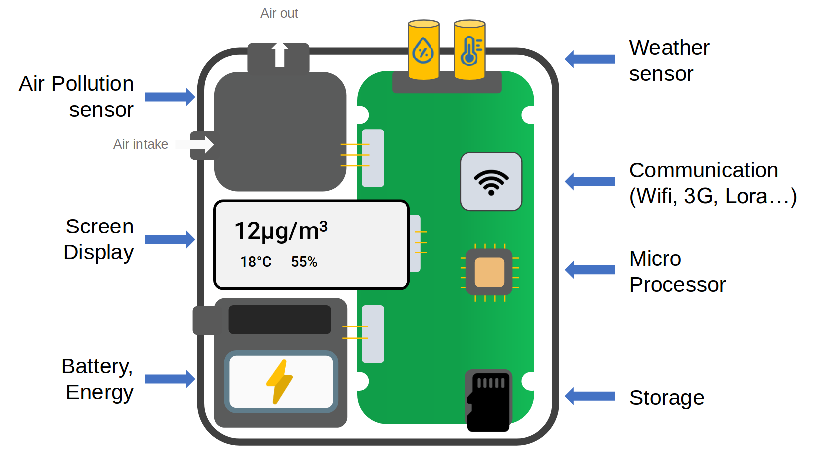

# What are the main elements of a sensing device?

## Description

A sensing device has various elements: the most important components are of course the sensing elements, but they are not the only ones. Typically, these sensing elements will interface with a microcontroller unit (or units) that collect, process and store the data either locally, or remotely, converting raw sensor readings into digital data for transmission and storage. The device is generally powered with batteries or low-power sources, and the whole setup can be enclosed in protective housing such as 3D printed casing.

## Why is this relevant?

Understanding the key components of a sensing device will help us navigate some of the technical aspects when using these devices for environmental monitoring. Having a clear overview of the principles of how devices are built and how they operate will help us make informed choices on the technical solutions that best fit our needs, and how they can be mounted or installed in situ

## How can this be done?

The sensing element (often called the sensor) and the sensing device are two different things. The sensing element refers to the actual component responsible for directly detecting the physical property or phenomenon being measured. It could be a small piece of material, or a specific technology designed to react to changes in the environment. For example, in an air pollution sensor, the sensing element might be an electrochemical cell that reacts with specific pollutants in the air.

The sensing device refers to the entire system, which includes the sensing element as well as any additional components necessary for the sensor's operation, such as signal processing, data communication, power management, and user interfaces. The sensing device integrates the sensing element into a functional unit capable of collecting data, processing it, and communicating results to the user or another system. In summary, while the sensing element is the core component responsible for detecting the physical property, the sensing device is the complete system that incorporates the sensing element along with other necessary components for its operation.

The affordability of sensing elements contrasts with the increased costs associated with integrating them into sensing devices due to various factors such as the engineering effort involved, and the overall design to incorporate additional components such as microcontrollers, communication interfaces, and power management systems for full functionality Quality control measures, including calibration processes, are necessary to ensure accurate and reliable sensor readings, contributing to manufacturing expenses. Furthermore, miniaturization and packaging requirements, coupled with the inclusion of features like data logging and wireless connectivity, drive up production costs. Compliance with regulatory standards and certifications also adds complexity and expense to the manufacturing process.

Sensing devices for monitoring air pollution typically include several key components:

1. **Sensing element / Environmental sensors:** this is the core component responsible for detecting pollutants in the air. Different sensors may use various technologies such as metal oxide semiconductor (MOS) sensors, electrochemical sensors, optical sensors (like laser-based sensors or light scattering sensors) depending on the type of pollutants they are designed to detect. In addition to pollutant detection, some sensing devices may integrate environmental sensors for measuring temperature, humidity, atmospheric pressure, or other relevant parameters. This additional data can provide context for interpreting air pollution levels.
2. **Microcontroller or Processor:** a microcontroller or processor handles data processing tasks, such as signal conditioning, calibration, and conversion of sensor readings into digital data. It may also control sensor operations and manage communication with external devices.
3. **Power supply:** sensing devices often use batteries or need to be connected to power supply sources for their operation. Some may also support energy harvesting techniques, such as solar power.
4. **Communication interface:** to transmit data to a central repository or database, these sensors require communication interfaces such as Wi-Fi, Bluetooth, Zigbee, or LoRa (Long Range). These interfaces enable the sensors to connect to networks or IoT platforms for data sharing and analysis.
5. **Enclosure:** an enclosure or casing protects the sensor components from environmental factors such as moisture, dust, and physical damage. Enclosures can be made from plastic, metal, or other materials suitable for outdoor or indoor use, and are often 3D-printed to custom fit the Sensing Device
6. **Data logging and storage:** some sensing devices may include onboard memory or storage capabilities to store data locally in case of communication disruptions. This feature ensures data integrity and enables offline data retrieval for analysis. This is particularly useful for applications where consistent access to a data or internet connection might be challenging.
7. **User interface:** depending on the application, sensors may feature a built-in or external screen or monitor user interface for configuration, status monitoring, and troubleshooting. This could be as simple as LED indicators or as complex as a graphical user interface (GUI) for more advanced settings. The term user interface also relates to any online or mobile data platform that provides a visual representation of the data gathered from the Sensing Device and the information that can be derived from it, and/or an operational interface with the device itself.
8. **Location-detection and GPS chips**: These is an additional possible component, especially for portable or wearable devices. GPS chips in mobile sensors enable precise location tracking that can enhance the application of the sensors. For example, in air quality monitoring, it can allow to calculate personal exposure, and identifying the areas with higher and lower exposure to air pollution.

## Useful resources

* Manuals and shopping lists for PM sensor devices in 24 languages: [Find your sensor and building instructions for your DYI fine dust sensor](https://sensor.community/en/sensors/)
* An overview of the different elements found on a Smart Citizen Kit, an open-source air quality monitor: [https://docs.smartcitizen.me/Smart%20Citizen%20Kit/](https://docs.smartcitizen.me/Smart%20Citizen%20Kit/)
* An EPA guide on low-cost air pollution monitors: [https://www.epa.gov/indoor-air-quality-iaq/low-cost-air-pollution-monitors-and-indoor-air-quality](https://www.epa.gov/indoor-air-quality-iaq/low-cost-air-pollution-monitors-and-indoor-air-quality)
* Airparif Dossier November 2023: Micro-sensors: a solution for the future? [https://www.airparif.fr/sites/default/files/document\_publication/AirparifDossier09\_microcapteurs\_Anglais\_web.pdf](https://www.airparif.fr/sites/default/files/document_publication/AirparifDossier09_microcapteurs_Anglais_web.pdf)

## You might also be interested in….

* [Who is who in air quality environmental monitoring?](../environmental-monitoring/who-is-who-in-air-quality-environmental-monitoring.md)
* [What technical aspects to consider when choosing an air quality sensing device?](what-technical-aspects-to-consider-when-choosing-an-air-quality-sensing-device.md)
* [What non-technical aspects to consider when choosing sensing devices?](what-non-technical-aspects-to-consider-when-choosing-sensing-devices.md)
* [What aspects to consider when choosing an infrastructure/platform?](what-aspects-to-consider-when-doing-mobile-monitoring.md)
* [What are the main aspects you need to consider when managing citizen collected data?](../managing-data/what-are-the-main-aspects-you-need-to-consider-when-managing-citizen-collected-data.md)
